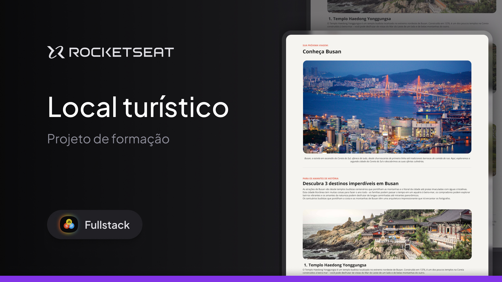

<h1 align="center">
  Local turístico
</h1>

## Projeto

Este projeto é uma página web desktop com informações sobre um local turístico.
Esse é um dos desafios práticos da formação Fullstack, um de nossos conteúdos de especialização.

## Tecnologias

Este projeto foi desenvolvido com as seguintes tecnologias:

- HTML
- CSS

---

Criado por Pedro Duarte
